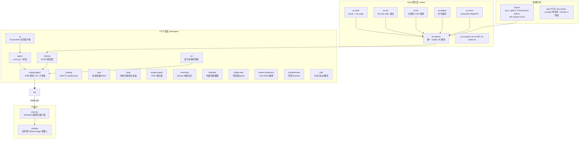

# oh-my-pi 深度架构对标分析与 Gyre 集成路线图

> 调研对象：`third/oh-my-pi`（badlogic/pi-mono 的 fork，MIT）
> 调研日期：2026-08-02
> 方法：6 路并行 scout 深挖双方源码（OMP 侧 `packages/agent`、`packages/ai`、`packages/coding-agent`、`packages/tui`、`crates/*`、`python/*`、构建/分发体系；Gyre 侧全部 27 个 crate 与 web 前端），主控逐一核验关键证据路径。
> 本文聚焦**架构级**对比（设计模式、模块边界、配置机制、工具链、工程纪律），与 [`oh-my-pi-feature-analysis.md`](oh-my-pi-feature-analysis.md)（功能级）和 [`agent-loop-improvement-plan.md`](agent-loop-improvement-plan.md)（循环引擎 10 轮移植记录）互补。
> 文中 omp 侧文件路径均相对 `third/oh-my-pi/`；Gyre 侧相对仓库根。`[INFERENCE]` 标注推断。

---

## 〇、结论速览

1. **OMP 是"TS 产品外壳 + Rust 原生内核"的双语言形态，Gyre 是纯 Rust 单二进制**。OMP 的引擎层（agent/ai/catalog）Gyre 已通过 10 轮移植消化（循环引擎九成已落地）；真正的架构级差距在**产品层子系统**（eval 内核、DAP、语音、记忆、统计、协作 UX、扩展生态）与**工程纪律**（文档体系、基准测试、发布管线）。
2. Gyre 在**代码卫生与分层严谨度上反超 OMP**（0 TODO、生产 unsafe 仅 1 处、`#![forbid(unsafe_code)]` 契约层、~685 项测试、clippy pedantic 全绿）；OMP 的 TS 侧存在 336KB 单文件（`agent-session.ts`）等巨型模块，可维护性并不优于 Gyre。
3. 四维差距排序：**功能覆盖度（大）> 用户体验（中）> 性能优化（小，且 Gyre 天然占优）> 代码可维护性（最小，Gyre 局部占优）**。
4. 最高借鉴价值的 8 项：**eval 双内核 + 环回桥、DAP 调试、bash 输出最小化器、goals/token 预算、统计仪表盘、/review 评审流、NDJSON RPC 外部集成面、会话操作补齐（/diff 等）**——前 4 项成本可控、收益立即可见。
5. 不建议移植：TUI 差分渲染引擎（25k 行 TS）、TS 动态插件系统、Bazel 构建矩阵、46 个 uutils 内嵌、40+ provider 全量。

---

## 一、OMP 全景解剖

### 1.1 仓库形态与模块地图

OMP = **四层结构**：Bun/TS workspace（15 个 packages）+ Rust N-API 原生层（9 个 pi-* crate + 49 个 vendor）+ Bazel 构建体系 + Python 外围（robomp/omp-rpc）。



### 1.2 核心功能模块（按子系统）

`packages/coding-agent/src/` 顶层 40+ 目录，按职责分组（规模 = 最大文件行数）：

| 分组 | 子系统 | 代表文件 | 职责 |
|---|---|---|---|
| 会话 | session | `session/agent-session.ts`(336KB)、`session-maintenance.ts`(129KB)、`session-manager.ts`(89KB)、`turn-recovery.ts`(69KB) | AgentSession 门面、JSONL 会话树、分支、恢复、维护 |
| 模式 | modes | `modes/interactive-mode.ts`(187KB)、`modes/controllers/*`、`rpc/`、`acp/` | 三种运行形态（TUI/print/RPC）+ 控制器模式（流式工具参数揭示等） |
| 工具 | tools | `tools/bash.ts`(66KB)、`tools/path-utils.ts`(54KB)、`tools/index.ts`(33KB)、69+ 工具文件 | 32 内置工具 + renderer + 审批挂接 |
| 任务 | task | `task/executor.ts`(120KB)、`task/index.ts`(57KB)、`isolation-runner.ts`、`structured-subagent.ts` | 子代理、PAL 隔离、schema 化 yield、IRC |
| SDK | sdk | `sdk.ts`(161KB) | 程序化嵌入 API |
| 配置 | config | `settings-schema.ts`(168KB)、`settings.ts`(88KB)、`model-registry.ts`(106KB)、`model-resolver.ts`(75KB) | 分层配置 + 模型目录/解析 |
| 命令 | slash-commands | `builtin-registry.ts`(115KB) | ~80 个 / 命令 |
| 语言服务 | lsp | `lsp/index.ts`(90KB)、`client.ts`(44KB)、`edits.ts`、`diagnostics-ledger.ts` | 14 ops + WorkspaceEdit 应用 |
| 执行后端 | exec/eval/dap/ssh/debug | `eval/`（py/js/jl/rb 四内核 + 桥）、`dap/`（28 ops）、`ssh/`（连接管理+sshfs） | 代码执行、调试、远程 |
| 记忆 | memories/hindsight/mnemopi | `hindsight/mental-models.ts`、`memories/storage.ts` | retain/recall、心智模型注入 |
| 安全 | security/secrets | `security/coordinator.ts`、`secrets/obfuscator.ts`(116KB) | SARIF 扫描、秘钥脱敏 |
| 语音 | tts/stt/live | `tts/`、`stt/`、`live/` | TTS/STT/实时语音会话 |
| 其他 | 内部URL、扩展、collab、commit、goals、plan-mode、web、mcp、tiny、autoresearch、autolearn、cleanse、irc、launch、registry | `internal-urls/router.ts`、`extensibility/`、`collab/`、`commit/agentic/`、`goals/runtime.ts`、`plan-mode/`、`web/search/`、`mcp/oauth-*.ts`、`tiny/`、`autoresearch/`、`cleanse/` | 见 §1.3 |

### 1.3 核心架构设计模式（10 个，均附证据）

1. **双层事件流冒泡**（engine 层）：provider 层 12 事件（`packages/ai/src/utils/event-stream.ts` 的 `EventStream<T,R>` 基类）→ agent 层 11 事件（`packages/agent/src/types.ts` 的 `AgentEvent` 联合）。流是"可终结的推送通道"而非回调：`push/end/fail/result` 四态 + 终端事件与错误分类挂钩。Gyre 等价物：`AgentEvent` enum + `Stream<Item=AgentEvent>`（crates/core），结构同构。
2. **无状态 run loop + 门面类**：`packages/agent/src/agent-loop.ts`(2870 行) 是纯函数式 runLoop/runLoopBody/streamAssistantResponse/executeToolCalls，状态由 `agent.ts`(1651 行) 门面持有（steering/followUp/aside 三队列 + streamFn/getApiKey/transformContext 钩子）。Gyre：`crates/agent/src/lib.rs` 把两者合并在 6037 行单文件——**结构同源、组织不同**（见 §三.2）。
3. **AppendOnlyLog + StablePrefix 契约**：`packages/agent/src/append-only-context.ts`——字节级稳定前缀 + 最长稳定前缀截断，prompt-cache 最大化是**架构不变量**而非优化项。Gyre 已移植（crates/context `StablePrefix` digest 序列），并在注释中明确继承此契约。
4. **Schema 即真相**：`config/settings-schema.ts`(5836 行) 同时驱动：类型解析、`/settings` TUI 面板分组、`omp config set` 值解析、CLI 凭据脱敏（`isCredential()` 单一访问器）。Gyre 配置为手写 TOML 结构体——无 schema→UI 联动（见 §三.2）。
5. **控制器模式**（modes/controllers/）：`tool-args-reveal.ts`、`streaming-reveal.ts` 把"流式工具参数部分揭示"做成可替换控制器；transcript 重建与 live 路径共用同一解码器（`decodeStreamedToolArgs`），防双路径漂移。Gyre 的 WS 增量线协议有类似思路但无控制器抽象。
6. **capability 注册表 + priority 遮蔽**：`discovery/`（builtin/claude/codex/cursor/gemini/opencode/github/windsurf…）各导入器以 priority 常量（100/80/70/…/1）注册，同名 key 遮蔽、suppressed 语义——**配置互操作是"能力合并"而非"文件转换"**。Gyre 的 crates/discovery 已落地四来源（AGENTS.md/CLAUDE.md/cursor/cline），尚未有 priority 遮蔽矩阵。
7. **内部 URL 路由器**：`internal-urls/router.ts` 进程级单例 `Map<scheme, ProtocolHandler>` + `ResolveContext` 注入会话状态；未注册 scheme 回退 MCP handler（开放命名空间）。15 个 scheme（file/web/archive/sqlite/pr/issue/agent/history/skill/rule/conflict/ssh/vault/mcp/xd）。Gyre 已有 skill/memory/mcp/local/artifact/http + pr/issue 路由（crates/tools/fs.rs），缺 agent/history/rule/ssh。
8. **xd:// 设备**：`internal-urls/xd-protocol.ts`——read 发现、write 执行；把"工具"降维成"文件写"（`write xd://resolve`、`xd://reject`、`write xd://<tool>` 跑设备工具）。Gyre 已移植 resolve 暂存（`write_file xd://resolve`），机制同构。
9. **N-API 薄壳 + napi-free 核心**：`crates/pi-natives` 是唯一 cdylib（35 模块 `#[napi]` 薄翻译），`pi-ast`/`pi-iso`/`pi-walker`/`pi-voice`/`pi-shell` 全是可单测的 rlib 核心（pi-voice 注释明言"避免整个依赖图随 N-API 表面变动重编"）。Gyre 纯 Rust 单进程天然就是这个结构。
10. **worker 单入口重入**：`cli.ts` 以 `declareWorkerHostEntry()` 声明自身为 worker host，隐藏 argv selector（`__omp_worker_*`）分派，避免每个 worker 一个编译入口（历史踩坑 #1011/#1027/#1150）。Gyre 单二进制无此问题。

### 1.4 配置管理机制

| 机制 | OMP 实现 | 证据 |
|---|---|---|
| 分层合并 | Settings 单例持有 **global→project→CLI overlay→runtime override** 四原始层，读取时 `#rebuildMerged()` 深合并（对象深合并、数组整体替换），未命中回退 schema 默认值 | `config/settings.ts`(:2143-2149) |
| env 变量 | 不是独立配置层，而是各特性直接消费的覆盖/回退源；`$env` 按 **进程→PWD/.env→agent/.env→config-root/.env→home/.env** 顺序加载；`OMP_*` 镜像 `PI_*` | `docs/environment-variables.md`(445 行) |
| profile 隔离 | `OMP_PROFILE` → `~/.omp/profiles/<name>/agent` 完整隔离配置根；键位 profile 继承合并 | `packages/utils/src/dirs.ts` |
| 健壮性 | config.yml 损坏隔离（`.broken-*` 备份）+ 原子写 + 文件锁 + 字段级自动迁移（legacy settings.json→config.yml 一次性迁移） | `config/settings.ts`(:1304-1325) |
| 凭据 | `isCredential()` 单一访问器统一 CLI 脱敏与面板掩码；api-key 解析器级联 provider→authStorage，a/b/c 重试（初始→强刷→轮换账号） | `config/settings-schema.ts`(:5580)、`config/api-key-resolver.ts` |
| CLI flags | 60+ flags（--model/--smol/--slow/--plan/--yolo/--thinking/--advisor/--no-pty…），CLI overlay 是四层之一 | `cli/commands/launch.ts` |
| 外部格式导入 | 8+ 来源（Cursor MDC/Cline/Codex AGENTS.md/Copilot/Gemini/OpenCode/Windsurf/VSCode）能力级合并 + priority 遮蔽 | `discovery/*.ts` |
| 主题/键位 | 60+ 内置 JSON 主题 + 自定义热重载；keybindings.yml 加载 + legacy 迁移 | `modes/theme/`、`config/keybindings.ts` |

**Gyre 对照**：TOML 分层 user→project 深度合并 + `${ENV}` 展开 + RulesEngine 审批（crates/config）——合并模型等价，但缺：schema→UI 联动、profile 隔离、原子写/损坏隔离、字段迁移、60+ flags 的运行时覆盖层。

### 1.5 底层工具链

**原生层职责矩阵**（全部相对 `third/oh-my-pi/crates/`）：

| crate | 能力 | Gyre 对应物 |
|---|---|---|
| pi-natives（唯一 cdylib） | 35 模块 N-API 薄壳：grep/glob/fd/ast/shell/iso/snapcompact/tokens/highlight/sixel/clipboard/desktop/ps/pty/audio/live/vectors/prof… | 天然无此层（纯 Rust 进程） |
| pi-shell | brush（vendored fork）+ 46 uutils 内嵌 + jaq；Shell 类 4837 行；**输出最小化器 ~30 过滤器**（git/gh/bun/cargo/docker/python/rust 输出压缩） | crates/pty + run_command；**无最小化器** |
| pi-ast | 69 种 tree-sitter 语法 + ast-grep-core（搜索/编辑共享 ops） | crates/ast（tree-sitter + ast-grep） |
| pi-iso | 8 后端 COW 隔离 PAL（APFS clonefile/overlayfs+fuse 回退/btrfs/ZFS/FICLONE/ProjFS/block clone/Rcopy）+ **git diff 捕获保证下游 git apply 字节一致** | crates/iso（rcopy/worktree）——**后端矩阵是差距** |
| pi-walker | 遍历缓存（TTL+黑名单）、rayon 并行、heartbeat（4928 行） | crates/search（ignore::WalkBuilder 并行 + 有界 LRU） |
| pi-uutils-ctx | 线程局部 stdio/cwd/env scope——uutils 的进程全局 I/O 重定向到 shell 命令 fd；catch_unwind 使 panic=命令失败 | 无（OS shell + 管道 fd 天然免此税） |
| pi-uu-grep / pi-uu-diff | ripgrep 库重写 grep builtin（GNU 退出码）、similar diff | crates/search + crates/tools（diff 经 similar） |
| pi-voice | miniaudio 录音/播放 + WebRTC opus 实时会话 | **无** |

**构建/分发管线**：Bazel（rules_rust + zig cc glibc-2.17 可移植下限 + musl 轴 + xwin MSVC 交叉 + ISA variant v2/v3 + crate_universe 单锁文件 + nightly sha256 预声明）→ `.node` addon → npm 叶包 / `bun build --compile` 单文件二进制（内嵌 tar.gz addon + 版本哨兵 + loader-state.js 平台探测）→ 三模式安装脚本（source/tarball/binary）+ install-tests 三形态 Docker 验收 + 4 阶段 Dockerfile + 预载 CI runner 镜像（infra/）。

**Python 外围**：`omp-rpc`（`omp --mode rpc` NDJSON 协议的类型化客户端：RpcClient/分块重装/分页/typed host tools + JSON Schema）与 `robomp`（自托管 GitHub triage/fix 机器人：webhook HMAC→sqlite 抢单队列→`blob:none` worktree 克隆池→omp RPC 子进程，`--continue` 续跑崩溃会话；host_tools 是唯一改 GitHub 的面）。

---

## 二、Gyre 现状基线

### 2.1 架构分层（27 crates，依赖单向无环）

```
L3 宿主层   cli / server / acp        （装配面：分层 TOML → ProviderRegistry → Context → ToolRegistry → TTSR/advisor → AgentBuilder）
L2 编排层   agent                     （run loop 五态状态机 + steering/aside/followUp 三通道 + TaskTool/KeyRing/PauseGate）
L1 能力层   config llm tools context ttsr advisor discovery lsp memory mcp search skills pty iso hashline ast prompt i18n telemetry swarm supervisor collab
L0 契约层   core                      （零业务依赖、#![forbid(unsafe_code)]、missing_docs）
```

关键特征：Ports & Adapters（`Arc<dyn Trait>` 注入）、`inventory` 编译期插件自荐、`core` 零依赖、`agent` 仅依赖 Trait。

### 2.2 已落地功能（源码级验证）

| 功能 | 证据路径（Gyre 侧） |
|---|---|
| TTSR 流规则 | crates/ttsr/{coordinator,rule,matcher,frontmatter}.rs；agent/src/lib.rs:1239-1312（流中匹配中断重试）、1487-1497（tool 载荷 digest abort）、2052-2057（never 变体） |
| Advisor | crates/advisor/{lib,guard,obfuscator,watchdog}.rs；cli/main.rs:494-523（GYRE_ADVISOR=1） |
| conflict:// | crates/tools/src/conflict.rs（@ours/@theirs/@base/@both + 批量） |
| magic keywords | crates/agent/src/keywords.rs（ultrathink/orchestrate/workflowz） |
| web_search | crates/tools/src/web_search.rs（DDG 免 key + searxng env 懒加载 + 站点抽取） |
| pr:///issue:// | crates/tools/src/github.rs:371-431（+ `.gyre/cache/github/` 指纹缓存） |
| LSP 写操作 | crates/lsp/src/edits.rs（UTF-16→字节、重叠校验、自底向上）；tools/lsp_apply.rs |
| resolve 暂存 | tools/ast_tool.rs:185-307（preview → 会话级队列 → xd://resolve 原子应用） |
| Provider fallback + key 轮换 | llm/registry.rs + agent/lib.rs KeyRing:126-161 |
| Collab 帧/权限/快照/重放 | crates/collab/{frame,codec,relay,snapshot}.rs + server 路由 |

### 2.3 工程卫生（可维护性基线）

- **unsafe**：生产仅 1 处（iso/src/rcopy.rs:393，带 SAFETY 注释）；core/lsp `#![forbid(unsafe_code)]`。
- **TODO/FIXME：全 workspace 0 处**；panic!/unimplemented! 生产代码几乎为零。
- **测试**：~685 项（tools 74 / context 70 / llm 67 / agent 60 / hashline 40 / config 37…），但**无 benches/、无 criterion**。
- 文档：`docs/` 仅 2 篇计划/调研文档（agent-loop-improvement-plan.md 106KB 是 10 轮移植记录，oh-my-pi-feature-analysis.md 32KB）。

---

## 三、四维差距分析

### 3.1 功能覆盖度（差距最大）

| # | 缺失功能 | OMP 证据 | Gyre 现状 | 借鉴价值 | 移植成本 |
|---|---|---|---|---|---|
| 1 | **eval 双内核 + 环回桥**（Python 持久内核 + JS worker，可回调 agent 工具） | `coding-agent/src/eval/`（py/js/jl/rb、tool-bridge token 注册 + abort 屏蔽、IdleTimeout） | ❌ 无 | ★★★★★ 数据分析硬缺口 | 中 |
| 2 | **DAP 调试器**（28 ops / lldb-dap/dlv/debugpy） | `coding-agent/src/dap/`（session.ts 60KB + client.ts 31KB + defaults.json） | ❌ debug 模式仅提示词差异 | ★★★★★ debug 模式名实相符 | 高 |
| 3 | **bash 输出最小化器**（~30 过滤器压缩 git/gh/cargo 输出） | `crates/pi-shell/src/minimizer/` | ❌ 只有命令拦截器 | ★★★★☆ token 成本 + 可读性 | 低 |
| 4 | **goals + token/时间预算** | `coding-agent/src/goals/runtime.ts`（input+cacheWrite+output 记账、continuation/budget-limit 提示） | ❌ 计划 P1-M 未做 | ★★★★☆ 预算控制 | 低 |
| 5 | **统计仪表盘**（JSONL→sqlite→React+Chart.js） | `packages/stats/`（server.ts 端口冲突恢复 #3847） | ⚠️ 有 /stats 端点 + telemetry，无本地可视化面板 | ★★★★☆ 成本/用量可见性 | 中 |
| 6 | **/review 评审流**（diff 噪音过滤 + 权重推荐 1-16 评审子代理 + P0-P3 分级） | `extensibility/custom-commands/bundled/review/index.ts` | ❌ 有 advisor 但无 review 命令 | ★★★★☆ 发布前质量门 | 中 |
| 7 | **NDJSON RPC 模式**（`--mode rpc` 类型化外部集成面） | `python/omp-rpc`（RpcClient + typed host tools） | ⚠️ 有 ACP/HTTP，无通用 RPC 协议 | ★★★★☆ 机器人/外围生态 | 中 |
| 8 | **会话操作补齐**（/diff、/fresh、快照恢复、加密分享） | `session/session-maintenance.ts`、`export/share.ts` | ⚠️ 有 fork/export/恢复 | ★★★☆☆ UX | 低 |
| 9 | **心智模型 / hindsight 记忆**（seeds 播种 + `<mental_models>` 注入） | `hindsight/mental-models.ts` | ⚠️ memory crate 有 BM25 记忆，无注入式心智模型 | ★★★☆☆ 跨会话沉淀 | 中 |
| 10 | **plan-mode**（写保护 + approved-plan + handoff + 模型切换） | `coding-agent/src/plan-mode/` | ❌ 计划 P2-M 未做 | ★★★☆☆ 流程约束 | 中 |
| 11 | **向量记忆**（fastembed 本地嵌入 + SQLite） | `packages/mnemopi/` | ❌ 计划 P2-1 未做（BM25） | ★★★☆☆ 语义检索 | 中-高 |
| 12 | **ssh 工具**（连接管理 + sshfs 挂载） | `coding-agent/src/ssh/` | ❌ 无 | ★★★☆☆ 远程仓库 | 中 |
| 13 | **browser 工具**（Puppeteer/Chromium/CDP） | `coding-agent/src/tools/browser.ts` | ❌ 无 | ★★★☆☆ Web 自动化 | 中-高 |
| 14 | **TTS/STT 语音** | `coding-agent/src/tts/`、`stt/`、`live/` | ❌ 无 | ★★☆☆☆ 差异化但非核心 | 高 |
| 15 | **prompt-cache 可见性**（cache_read/write 统计进 /status） | `utils/token-rate.ts` | ⚠️ 有 token 计数，无 cache 命中统计 | ★★★☆☆ 成本优化反馈 | 低 |
| 16 | **/fresh、session diff、gallery** | `slash-commands/builtin-registry.ts` | ❌ | ★★☆☆☆ | 低 |
| 17 | **远程压缩**（OpenAI/Codex 服务端 compaction） | `agent/compaction/compaction.ts` | ❌ 计划 P2-E 未做 | ★★☆☆☆ | 中 |
| 18 | **本地小模型**（tiny title 生成、设备端推理） | `coding-agent/src/tiny/` | ❌ | ★★☆☆☆ | 高 |
| 19 | **自动研究/自动学习**（autoresearch/autolearn） | `coding-agent/src/autoresearch/`、`autolearn/` | ❌ | ★★☆☆☆ | 中-高 |
| 20 | **agent registry / launch broker**（持久子代理 + 终端输出 worker） | `coding-agent/src/registry/`、`launch/` | ❌ | ★★☆☆☆ | 高 |
| 21 | **computer-use 桌面控制** | `docs/computer-use.md`（X11 XTEST/Quartz + 三层安全） | ❌ | ★☆☆☆☆ | 高 |
| 22 | **Web provider 广度**（23 search provider / 76 provider 注册表 / 10.5 万行模型目录） | `packages/ai/src/registry/registry.ts`、`catalog/src/models.json` | ⚠️ 4-5 适配器 + fallback 链 | ★★★☆☆ 稳定性红利 | 中 |
| 23 | **扩展/插件市场**（TS 模块钩子 + marketplace + smithery） | `extensibility/`、`mcp/smithery-*.ts` | ⛔ 走 inventory 编译期路线 | ★☆☆☆☆ 与 Rust 架构冲突 | — |

### 3.2 代码可维护性（Gyre 局部占优，但有三处短板）

**Gyre 优势**（证据见 §2.3）：
- 契约层零依赖 + `#![forbid(unsafe_code)]`；全 workspace 0 TODO；~685 测试；clippy pedantic + correctness deny 全绿。
- OMP TS 侧的巨型文件（agent-session.ts 336KB、settings-schema.ts 168KB、sdk.ts 161KB、interactive-mode.ts 187KB）在 Gyre 中不存在同规模反例。

**Gyre 短板**：

| 短板 | 现状 | OMP 对照 | 建议 |
|---|---|---|---|
| **agent/lib.rs 单体**（6037 行） | run loop + steering + TTSR 集成 + advisor 集成 + harmony + keywords + KeyRing + TaskTool 全在一个文件 | agent-loop.ts(2870) 与 agent.ts(1651) 分离为"无状态循环 + 门面" | 拆分为 `run_loop/`、`steering.rs`、`injections.rs` 等模块（见 §五.5） |
| **文档纪律** | docs/ 仅 2 篇计划文档；无"子系统→文档"索引 | 70+ 篇 docs 按子系统索引，DEVELOPMENT.md 是开发者地图（每目录→权威文档） | 每 crate 一篇架构文档 + 根级索引 |
| **基准测试缺失** | 无 benches/、无 criterion、无性能回归门 | tui/natives/hashline/mnemopi 各有 bench + typescript-edit-benchmark 包 + session-tree-nav.bench.ts | 热路径 bench + CI 回归门（见 §五.6） |
| **配置 schema 单一真相** | TOML 手写结构体，/settings 面板手写 | settings-schema.ts 驱动类型/UI/CLI set/脱敏 | schema 驱动生成（见 §五.7） |

### 3.3 性能优化（Gyre 天然占优，借鉴 3 点）

**Gyre 已占优**：纯 Rust 单进程（无 N-API 往返/序列化）、ripgrep-core 并行遍历 + 4MiB 单文件上限 + max_hits 早停、tiktoken 精确计数、StablePrefix digest 保 prompt-cache、TTSR 线性正则（OMP JS 版有 ReDoS 面）、Shared/Exclusive 工具并发。

**OMP 可借鉴 3 点**：

1. **bash 输出最小化器**（pi-shell/src/minimizer/，~30 过滤器）：git/gh/bun/cargo/docker 等命令输出压缩为摘要——省 token（模型少读几千行）且省渲染。Gyre 有命令拦截器（cat→read_file）但无输出侧压缩。[INFERENCE：未逐过滤器核对，但 minimizer 目录存在且 Shell 类引用]
2. **fs 扫描缓存**（fs-scan-cache-architecture.md：`(root, WalkOptions)` 键 + 1s TTL + 路径失效，非 mtime 键）：Gyre 有 16 root LRU 缓存，粒度更粗；OMP 的"路径级失效"（bash 写文件即失效对应目录）更精确，且与 bash/工具副作用联动。[INFERENCE：OMP 文档描述]
3. **性能可见性**：OMP 有 token-rate.ts（速率显示）、/status 用量、stats 仪表盘。Gyre /status 有 token 计数，缺 cache hit 统计与速率。

### 3.4 用户体验（命令面与终端体验差距显著）

| 维度 | OMP | Gyre | 差距 |
|---|---|---|---|
| slash 命令 | ~80（builtin-registry.ts 3138 行：/review /collab /advisor /goals /plan /fresh /diff /sessions /model /compact…） | 21（/h /help /status /model /mode /paste /enhance /suggest /compact /mcp /skill(s) /sessions /swarm /agents /collab /github /tools /lang /exit） | 命令面 4 倍差距；缺 /review /diff /fresh /goals 等 |
| 终端渲染 | 差分渲染 TUI：append-only scrollback 契约 + 提交账本（C/W/B/D）+ 10 条渲染不变式 + DEC 2026 sync output + 图片探测；工具结果卡片化 | rustyline 行编辑 + Markdown 流式渲染 + syntect 高亮 | Gyre 走 Web 路线，终端面是重活（不移植引擎，借鉴契约思想） |
| 协作 UX | collab 链接 + **QR 码** + 浏览器 guest + 只读链接 + 断线指数退避 | collab 已具备帧/权限/guest/历史重放，无 QR | 小差距 |
| 可观测 | `omp stats` 本地仪表盘（React+Chart.js） | /stats 端点 + supervisor 仪表盘（Web） | 中等 |
| 评审 | /review 交互式菜单 + P0-P3 分级 + 置信度 | advisor 每 4 轮注入 | 互补：advisor 持续、review 一次 |
| 语音/多模态 | TTS/STT/实时语音 | 无 | 差异化卖点，非核心 |

---

## 四、高价值缺失功能优先级矩阵

| 优先级 | 功能 | 成本 | 收益 | 依赖 |
|---|---|---|---|---|
| 🔴 P0 | eval 内核 + 环回桥 | 中 | 数据分析硬缺口 | python3 运行时 |
| 🔴 P0 | bash 输出最小化器 | 低 | token 成本 -30%+（git/cargo 场景）[INFERENCE] | 无 |
| 🔴 P0 | goals + token/时间预算（执行 P1-M） | 低 | 预算控制 | 无 |
| 🔴 P0 | prompt-cache 可见性（/status 增强） | 低 | 成本优化反馈环 | llm usage 已就绪 |
| 🔴 P0 | NDJSON RPC 模式 | 中 | 外部生态/机器人集成面 | server 已有 |
| 🟡 P1 | DAP 调试（先 lldb-dap/dlv/debugpy） | 高 | debug 模式名实相符 | 无 |
| 🟡 P1 | /review 评审流 | 中 | 发布质量门 | TaskTool 已就绪 |
| 🟡 P1 | 统计仪表盘（本地可视化） | 中 | 用量/成本可见 | /stats + telemetry |
| 🟡 P1 | 会话操作 /diff /fresh | 低 | UX | 会话树已就绪 |
| 🟡 P1 | plan-mode（写保护 + handoff） | 中 | 流程约束 | approval 引擎 |
| 🟡 P1 | 心智模型注入（执行 P2-L） | 中 | 跨会话沉淀 | memory crate |
| 🟢 P2 | ssh 工具 | 中 | 远程仓库 | 无 |
| 🟢 P2 | browser 工具 | 中-高 | Web 自动化 | chromium |
| 🟢 P2 | snapcompact（执行 P0-L 既定设计） | 高 | 压缩成本降一个数量级 | PNG 依赖 + Image 块 + 视觉 eval |
| 🟢 P2 | 向量记忆（执行 P2-1） | 中-高 | 语义检索 | 本地嵌入模型 |
| 🟢 P2 | 远程压缩（P2-E） | 中 | 长会话省 token | provider 支持 |
| ⚪ P3 | TTS/STT、tiny 本地模型、computer-use、marketplace、agent registry、launch broker、autoresearch、cleanse、omp commit | 高 | 差异化 | 各自独立 |

---

## 五、落地建议（可操作集成方案）

> 集成原则：**每个新能力 = 新 crate 或既有 crate 新模块 + 装配点（cli/main.rs 或 server/lib.rs）一行注册 + 单测锁定契约**，与现有 27 crate 分层保持一致；OMP 侧实现只作语义参考，不拷贝 TS 代码。

### P0-1 eval 内核 + 环回桥（新 crate `crates/eval`）

- **移植对象**：`coding-agent/src/eval/`（executor-base/kernel-base/agent-bridge/tool-bridge/idle-timeout）。
- **步骤**：①`EvalKernel` trait（spawn/exec/reset/interrupt/idle 超时），Python 内核：spawn `python3 -u` + NDJSON 行协议（会话级保留，按 sessionId+cwd 键控）；②环回桥：127.0.0.1 HTTP，bearer token 按 run 注册、abort 传播——**安全模型照搬**（token 生命周期、abort 屏蔽、注册一次）；③工具面：`eval` 工具（语言/代码/内核保留/重置）；④JS 内核可选（Rust 侧无内置 JS 引擎，`[INFERENCE]` 可先只做 Python，JS 走 Bun 子进程或延后）。
- **风险**：桥的 SSRF/权限面（仅回环 + token）；Python 依赖环境缺失时优雅报错。
- **验证**：单测覆盖 NDJSON 往返、abort 传播、token 失效；冒烟：`eval` pandas describe + 回调 `tool.read`。

### P0-2 bash 输出最小化器（crates/tools 扩展）

- **移植对象**：`crates/pi-shell/src/minimizer/` 的**分类理念**（按命令类型压缩输出），非逐过滤器拷贝。
- **步骤**：①`OutputMinimizer` trait + 内置过滤器注册表（git status/diff/log、cargo build/test、docker、gh 高频输出）；②run_command 结果路径挂接：检测命令前缀 → 命中过滤器 → 输出替换为压缩摘要 + 原始输出存 `artifact://` 可回读；③配置开关 `[tools.minimizer] enabled`。
- **风险**：误压缩破坏模型可读性（保留原始输出回读通道即兜底）。
- **验证**：fixture 单测（git status 脏树输出 → 摘要含文件数与冲突标记）。

### P0-3 goals 预算（执行 P1-M，crates/agent + crates/config）

- **移植对象**：`goals/runtime.ts`（input+cacheWrite+output 记账、wall-clock、continuation/budget-limit 提示）。
- **步骤**：①`GoalBudget`（token 上限/时间上限/目标文本）进 config `[goals]`；②run_loop 每轮汇总 Usage 记账；③超限 → 停止边界注入预算提示（复用三通道注入）+ 可选硬停；④`/goal` 命令（查看/设置/续期）。
- **风险**：cacheWrite 计费口径随 provider 差异（按 usage 字段实报即可）。
- **验证**：单测模拟 Usage 累计与超限触发；集成：小预算跑长任务观察注入。

### P0-4 prompt-cache 可见性（crates/llm + crates/cli）

- **步骤**：①llm 响应 Usage 已含 cache_read/cache_write（openai/anthropic 适配器补字段映射）；②`AgentEvent::UsageUpdate` 透传；③`/status` 显示本轮/累计 cache 命中率与估算节省；④Web /stats 同源。
- **验证**：两次相同前缀请求，第二次 cache_read>0。

### P0-5 NDJSON RPC 模式（crates/server 或 crates/cli）

- **移植对象**：`omp --mode rpc` 协议面（`docs/rpc.md`：NDJSON 帧 + 命令/事件子协议 + 队列并发语义），不需要 full 协议，先定最小集。
- **步骤**：①`agent --rpc`：stdin/stdout NDJSON（`{"type":"prompt","text":…}` / `{"type":"event",…}`），复用 server 的 SessionManager（与 ACP 同源）；②定稿协议文档 docs/rpc.md；③Python 参考客户端（python/omp-rpc 的 RpcClient 约 300 行语义）。
- **风险**：协议过早冻结（先内部用，标 experimental）。
- **验证**：echo 一个 prompt → 流式事件 → stop；并发两客户端订阅同一会话。

### P1-1 DAP 调试器（新 crate `crates/dap`）

- **移植对象**：`coding-agent/src/dap/`（client.ts 帧/传输、session.ts 会话树、config.ts 适配器选择）。
- **步骤**：①DAP 客户端（Content-Length 帧、stdio/unix-socket/TCP、`${port}` 替换）；②会话树管理（launch/attach 握手、断点同步、空闲清理）；③三适配器优先：lldb-dap/dlv/debugpy；④工具面精简（先 10 ops：launch/attach/continue/pause/next/step/stack/scopes/variables/evaluate/breakpoints）。
- **风险**：适配器行为差异大（按适配器打标测试）；工作量大，分两期（客户端 + 工具面）。
- **验证**：llvm 安装场景下冒烟：启动 → 断点 → 步进 → 读变量；无适配器时优雅降级提示。

### P1-2 /review 评审流（crates/agent 或 crates/cli + TaskTool）

- **移植对象**：`custom-commands/bundled/review/index.ts` 的流程（diff 收集 → 噪音过滤 → 按 diff 权重推荐评审者 → P0-P3 分级 + 置信度）。
- **步骤**：①`/review` 命令：收集 git diff（staged/unstaged/branch）；②按文件权重（新增行数/复杂度）分配 1-N 个 TaskTool 子代理并行评审；③结果聚合为分级表注入会话；④与 advisor 分工：review=一次快照评审，advisor=持续旁观。
- **风险**：子代理评审质量方差（评审提示词模板化）。
- **验证**：构造含故意 bug 的 diff，断言评审报告命中 bug 级别。

### P1-3 统计仪表盘（crates/server 扩展 + web 页面）

- **步骤**：①现有 `/api/stats` 扩展：会话/工具/模型/用量/耗时聚合（SQLite 或内存窗口）；②web/c5-ui 增 Statistics 页（Chart.js 或轻量自绘）；③telemetry crate 已有 OTel 导出，本地面板先于 OTel 独立。
- **风险**：与 telemetry 重复造轮（先定边界：面板消费 session JSONL，OTel 服务生产）。
- **验证**：跑 3 个会话后面板数据与 /status 一致。

### P1-4 会话操作 /diff /fresh（crates/cli）

- **步骤**：①`/diff`：当前分支 vs 另一分支/checkpoint 的 diff（复用 hashline snapshot 或 git）；②`/fresh`：重置 provider 流状态不动本地记录（fork 已有，加轻量版）；③`/sessions` 增强：最近列表 + 恢复摘要。
- **验证**：REPL 冒烟。

### P1-5 plan-mode（crates/agent + crates/tools）

- **移植对象**：`plan-mode/`（写保护 + approved-plan + handoff + 模型切换）。
- **步骤**：①`[plan_mode]` 配置 + `/plan` 命令：进入后写类工具仅 allow 对 `plans/*.md`（复用 config RulesEngine 的模式契约）；②`write xd://propose` 提交计划 → 审批 → 解锁写；③handoff 模板注入。
- **风险**：与现有 approval_mode 交互语义（yolo 优先级明确化）。
- **验证**：单测：plan 模式写 src/ 被拒、写 plans/ 放行。

### P1-6 心智模型（crates/memory 扩展）

- **移植对象**：`hindsight/mental-models.ts`（seeds 播种 + `<mental_models>` 注入 developer instructions + 5min 刷新）。
- **步骤**：①memory crate 增加 mental-model 存储（seeds.json + 会话结束 LLM 合并）；②启动注入摘要（已有 memory 注入通道复用）；③按项目作用域。
- **风险**：注入质量方差（仅注入高置信条目）。
- **验证**：跨会话：会话 A 记录惯例 → 会话 B 首轮注入可见。

### P2 其余（按资源排期）

- **ssh 工具**：连接管理（ssh-config 解析 + 密钥）+ 单命令执行 + 可选 sshfs；crates/tools 新模块。
- **browser 工具**：可选 chromium CDP 驱动（crates/browser），与 server 解耦。
- **snapcompact**：按 P0-L 既定设计（PNG 依赖 + `ContentBlock::Image` 贯通 + 视觉模型 eval 召回率——前置不可跳过）。
- **向量记忆**：执行 P2-1（本地嵌入：candle/ort 轻量方案 [INFERENCE：需评估] 或 fastembed 等价），后端与心智模型统一存储。
- **远程压缩**：执行 P2-E（OpenAI/Codex 原生 compaction 端点，config 开关）。
- **语音/小模型/桌面控制/市场**：P3 按需，不与核心路线冲突。

---

## 六、重构方向与最佳实践（对 Gyre 自身）

1. **拆分 agent/lib.rs 单体**（最高优先级的内部重构）：6037 行已超认知负荷。按 OMP 的"无状态循环 + 门面"拆：`run_loop.rs`（纯逻辑，trait 注入）、`steering.rs`（三通道队列与 drain）、`injections.rs`（TTSR/advisor/followUp 注入点）、`harmony.rs`（已有）、`task_tool.rs`（已有）。拆分时保持现有单测契约不动（685 项是安全网）。
2. **建立基准测试纪律**：criterion bench 覆盖热路径——grep/glob 吞吐、tiktoken 计数、run loop 事件吞吐、压缩耗时、TTSR 匹配延迟；CI 门（如 p99 回归 >10% 报警）。这是与 OMP 工程差距中最易补的一项。
3. **文档体系升级**：每 crate 一篇架构 doc + 根级 DEVELOPING.md 索引（子系统→文档→测试入口），对齐 OMP DEVELOPMENT.md 模式；把 10 轮移植记录沉淀为"当前架构说明书"而非历史。
4. **配置 schema 驱动**：为 crates/config 引入 schema（schemars 已在依赖中）→ `/settings` Web 面板与 `config set` 校验生成式联动；补原子写 + 损坏隔离 + 用户/项目/profile 三层隔离（OMP_PROFILE 等价：`GYRE_PROFILE`）。
5. **发布管线**：install.sh 三模式（source/binary）、升级检查、Dockerfile 精简版（Gyre 单二进制无 natives 阶段，可 2 阶段）、GitHub Actions 全平台矩阵（现有 .github/workflows 基础上补 install-tests 验收形态）。
6. **测试契约纪律保持**：Gyre 已符合 OMP 的"测试外部契约、禁源码 grep、full-suite safe"要求；新增子系统（eval/dap）沿用。
7. **对外协议统一**：ACP + NDJSON RPC + WS 三面共享 SessionManager 与审批（现状 ACP/Web 已同源，RPC 加入后保持三端等价）。

---

## 七、不建议移植清单

| 项 | 原因 |
|---|---|
| TUI 差分渲染引擎（25k 行 TS） | 与 Gyre 的 rustyline + Web 双前端路线冲突；只借鉴 append-only 回滚契约思想到 Web 端 diff 推送 |
| TS 动态插件/市场系统 | Rust 无模块动态加载；inventory 编译期注册 + 配置驱动已是等价替代；WASM 插件是另一课题 |
| Bazel 构建矩阵（zig cc/musl/xwin/ISA variant） | Gyre cargo 单二进制无需 FFI 分发；仅在多平台发布需求出现时参考 toolchain 组合 |
| 46 个 uutils 内嵌 + brush | Gyre 用 OS shell + 管道天然等价，内嵌 coreutils 是为"Windows 无 bash"付的税；pi-uutils-ctx 的 catch_unwind 纪律可借鉴 |
| 40+/76 provider 全量 | 长尾 provider 维护成本高；Gyre 的 trait + 插件注册已支持按需接入，先保 openai/anthropic/deepseek/glm 质量 |
| 巨型单文件模式（agent-session.ts 336KB 等） | OMP 自身可维护性反例，Gyre 已证明拆分配置更好 |

---

## 八、验证方法与注意事项

1. **eval 桥安全**：token 按 run 注册、abort 屏蔽、仅回环——OMP 踩过的坑（`tool-bridge.ts` bearer token 模式）必须照搬，勿自创简化版。
2. **最小化器**：误压缩比不压缩更糟——原始输出必须可经 `artifact://` 回读；每个过滤器配 fixture 单测。
3. **DAP**：适配器行为差异是主要风险源，先锁定 lldb-dap 单适配器打通再扩；`${port}` 替换与 socket 就绪门是常见坑。
4. **goals 记账口径**：cacheWrite 计费因 provider 而异，按 usage 实报字段记账，勿跨 provider 折算。
5. **RPC 协议**：先标 experimental 冻结最小集，避免过早承诺；与 ACP 的事件序列保持一致（复用 session/update 形状）。
6. **snapcompact 前置不可跳过**：PNG 依赖 + Image 块贯通 + **真实视觉模型 eval**（SQuAD 数据：差的帧形状 f1 0.287 劣于文本摘要）。
7. **基准门**：性能回归门只对已 bench 的热路径生效；新 bench 先立基线再定阈值，防噪声误杀。

---

## 九、结语

Gyre 与 OMP 是同源对照移植关系（计划文档逐轮引用 OMP 文件与行号），循环引擎层已基本追平甚至反超（TTSR 线性正则、conflict 批量、契约层零依赖）。下一阶段的主战场是**产品层子系统与工程面**：优先补 eval/DAP/goals/最小化器/RPC 五个 P0-P1 项，同时完成 agent 单体拆分与基准纪律两项内部重构——前者补能力空白，后者守住已有 685 项测试红利不被新功能稀释。
